# 🏗️ TAFSILK PLATFORM - LAYER COMMUNICATION ARCHITECTURE

## **📊 Complete System Architecture**

This document provides a comprehensive view of the Tafsilk Platform's layered architecture, showing how different components communicate with each other.

---

## **🎯 HIGH-LEVEL ARCHITECTURE OVERVIEW**

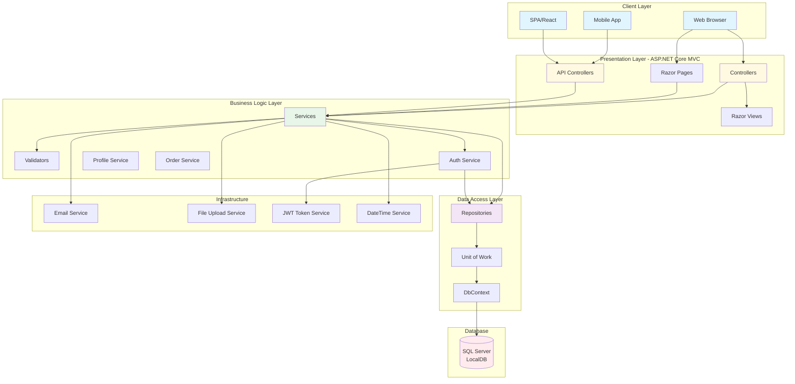

---

## **🔄 DETAILED LAYER COMMUNICATION**

### **1. Presentation → Business Logic → Data Access**

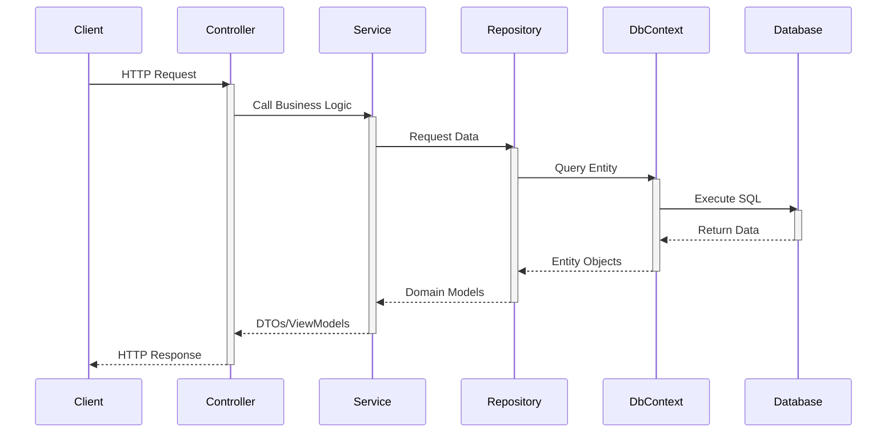

---

## **🎭 AUTHENTICATION FLOW**

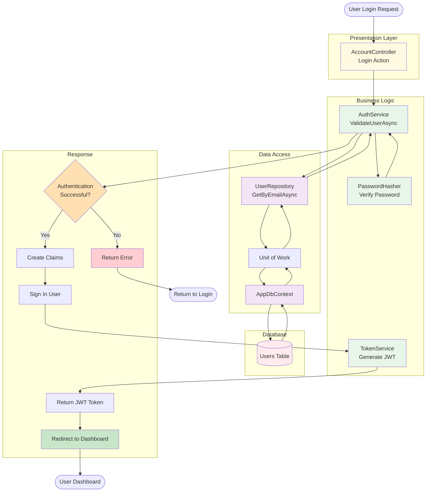

---

## **🛒 ORDER PROCESSING FLOW**

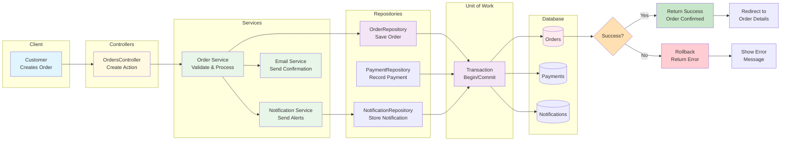

---

## **📱 API AUTHENTICATION (JWT) FLOW**

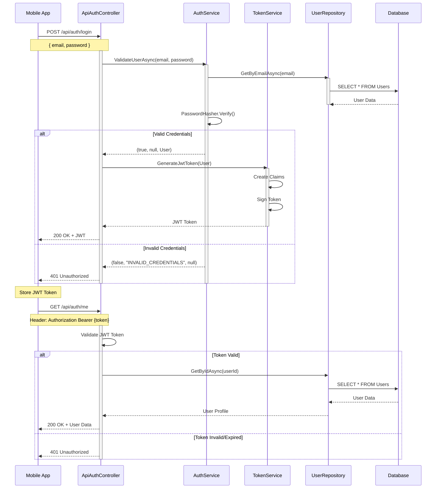

---

## **🗂️ REPOSITORY PATTERN & UNIT OF WORK**

```mermaid
classDiagram
    class IUnitOfWork {
        <<interface>>
+Users: IUserRepository
   +Customers: ICustomerRepository
        +Tailors: ITailorRepository
        +Orders: IOrderRepository
        +Payments: IPaymentRepository
        +SaveChangesAsync()
        +BeginTransactionAsync()
        +CommitAsync()
        +RollbackAsync()
    }
    
    class UnitOfWork {
     -AppDbContext _context
        +Users: IUserRepository
 +Customers: ICustomerRepository
        +SaveChangesAsync()
        +BeginTransactionAsync()
    }
    
    class IRepository~T~ {
        <<interface>>
        +GetByIdAsync(id)
        +GetAllAsync()
     +AddAsync(entity)
        +UpdateAsync(entity)
        +DeleteAsync(id)
        +FindAsync(predicate)
    }
    
    class EfRepository~T~ {
        -AppDbContext _context
        -DbSet~T~ _dbSet
        +GetByIdAsync(id)
   +GetAllAsync()
        +AddAsync(entity)
}
    
    class UserRepository {
     +GetByEmailAsync(email)
        +GetUserWithProfileAsync(id)
    }
    
    class OrderRepository {
        +GetOrdersByCustomerIdAsync(id)
    +GetOrdersByTailorIdAsync(id)
    }
    
    class AppDbContext {
        +Users: DbSet~User~
   +Orders: DbSet~Order~
        +OnModelCreating()
    }
    
    IUnitOfWork <|.. UnitOfWork
    IRepository~T~ <|.. EfRepository~T~
    EfRepository~T~ <|-- UserRepository
    EfRepository~T~ <|-- OrderRepository
    UnitOfWork --> AppDbContext
    EfRepository~T~ --> AppDbContext
 UnitOfWork --> IRepository~T~

    style IUnitOfWork fill:#e1f5ff
    style IRepository~T~ fill:#e1f5ff
    style UnitOfWork fill:#e8f5e9
    style EfRepository~T~ fill:#f3e5f5
    style AppDbContext fill:#ffebee
```

---

## **🔐 MIDDLEWARE PIPELINE**

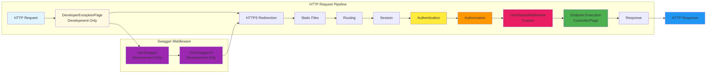

---

## **🏛️ LAYERED ARCHITECTURE (N-TIER)**

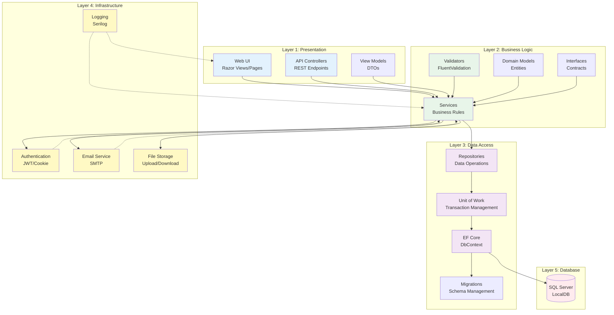

---

## **🔄 DEPENDENCY INJECTION (IoC CONTAINER)**

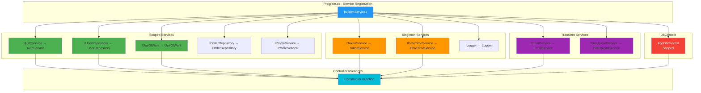

---

## **📊 DATA FLOW: USER REGISTRATION**

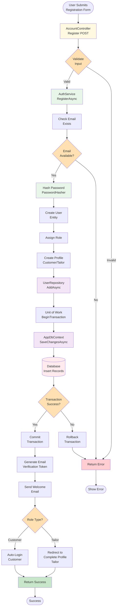

---

## **🎨 FRONT-END TO BACK-END COMMUNICATION**

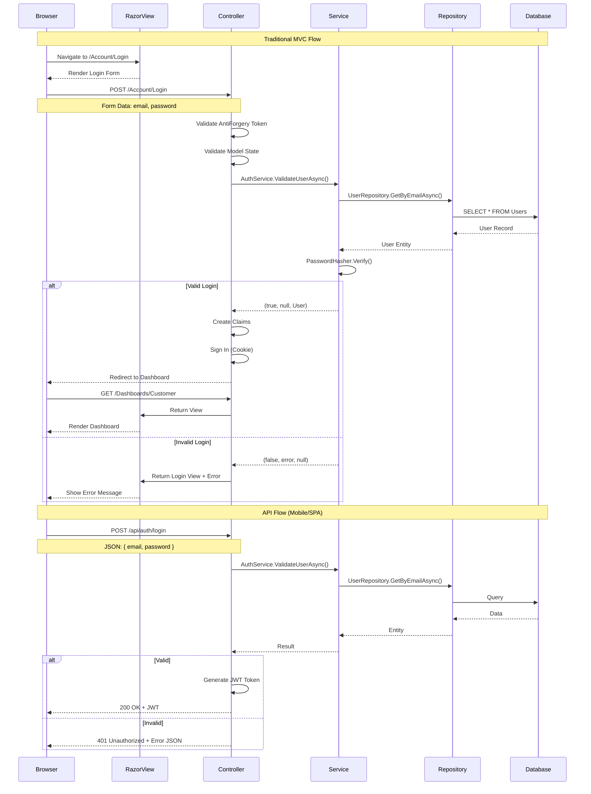

---

## **🔧 SERVICE LAYER INTERACTIONS**

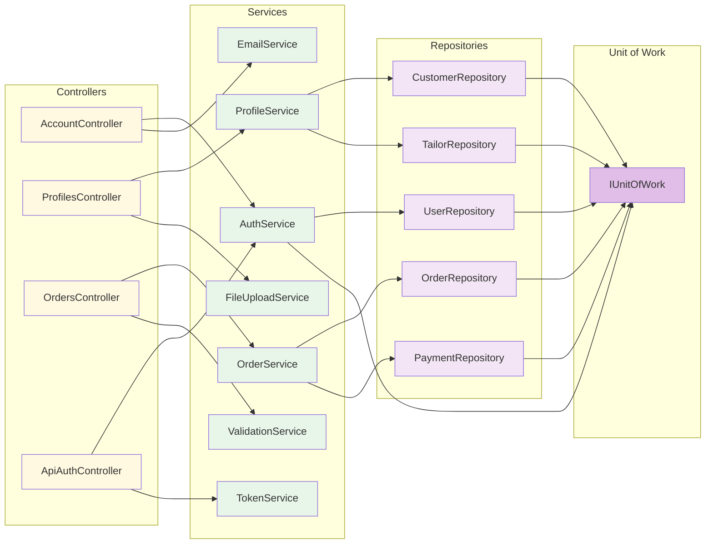

---

## **📱 COMPLETE USER JOURNEY: CUSTOMER ORDERS TAILOR**

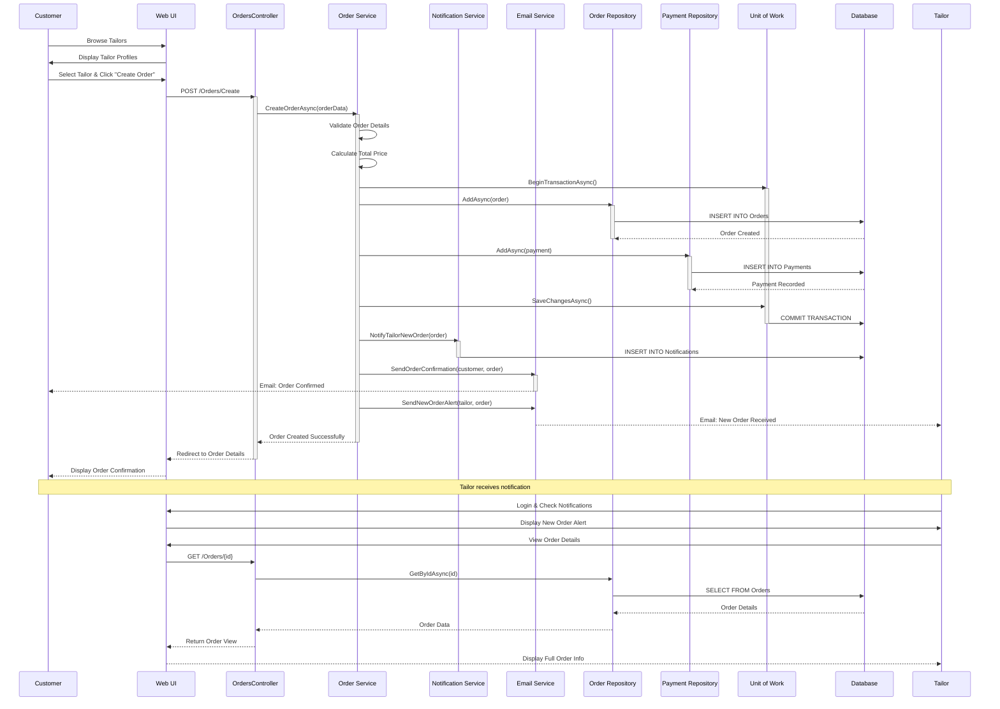

---

## **🎯 KEY ARCHITECTURAL PATTERNS**

### **1. Repository Pattern**
- Abstracts data access logic
- Provides clean API for domain objects
- Makes testing easier (mockable)

### **2. Unit of Work Pattern**
- Coordinates transactions across multiple repositories
- Ensures data consistency
- Manages DbContext lifecycle

### **3. Dependency Injection**
- Loose coupling between components
- Easier testing and maintenance
- Configured in `Program.cs`

### **4. Service Layer Pattern**
- Encapsulates business logic
- Provides reusable operations
- Keeps controllers thin

### **5. DTO/ViewModel Pattern**
- Separates domain models from presentation
- Controls data exposure
- Validates input/output

---

## **📊 TECHNOLOGY STACK**

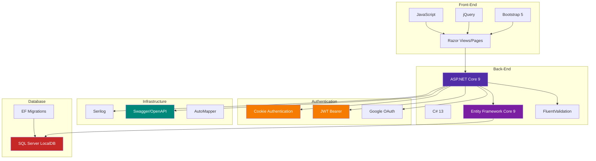

---

## **📝 SUMMARY**

### **Layer Responsibilities:**

| Layer | Responsibility | Examples |
|-------|---------------|----------|
| **Presentation** | User interface, HTTP handling | Controllers, Views, API |
| **Business Logic** | Business rules, validation | Services, Validators |
| **Data Access** | Database operations | Repositories, DbContext |
| **Infrastructure** | Cross-cutting concerns | Email, File Storage, Logging |
| **Database** | Data persistence | SQL Server, Tables |

### **Communication Patterns:**

- **Top-Down**: Presentation → Business → Data → Database
- **Dependency Injection**: All layers use interfaces
- **Async/Await**: Throughout the stack
- **Transaction Management**: Unit of Work pattern
- **Error Handling**: Try-catch with logging

### **Key Benefits:**

✅ **Separation of Concerns** - Each layer has single responsibility  
✅ **Testability** - Mock dependencies easily  
✅ **Maintainability** - Changes isolated to specific layers  
✅ **Scalability** - Can scale individual components  
✅ **Reusability** - Services can be shared across controllers  

---

**Date:** 2025-01-20  
**Architecture:** N-Tier Layered Architecture  
**Framework:** ASP.NET Core 9.0  
**Pattern:** Repository + Unit of Work + Service Layer  

---

**🎉 Tafsilk Platform - Built with Clean Architecture Principles!**

**تفصيلك - نربط بينك وبين أفضل الخياطين** 🧵✂️
