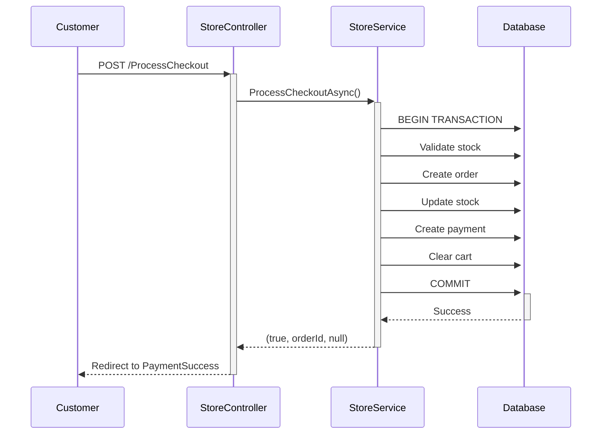

# Payment Workflow - Developer Quick Reference

## 🚀 Quick Start

This guide provides everything you need to understand and work with the payment system.

---

## 📁 File Locations

### Controllers
- **StoreController.cs** - Main e-commerce controller
  - `GET /Store/Checkout` - Checkout page
  - `POST /Store/ProcessCheckout` - Submit order (CRITICAL)
  - `GET /Store/PaymentSuccess/{orderId}` - Confirmation page

### Services
- **IStoreService.cs** - Service interface
- **StoreService.cs** - Implementation with ProcessCheckoutAsync()

### Repositories
- **IPaymentRepository.cs** - Payment data access interface
- **PaymentRepository.cs** - Payment repository implementation
- **IShoppingCartRepository.cs** - Cart interface
- **ShoppingCartRepository.cs** - Cart implementation

### Models
- **Payment.cs** - Payment entity
- **Order.cs** - Order entity
- **OrderItem.cs** - Order line items
- **ShoppingCart.cs** - Shopping cart
- **CartItem.cs** - Cart line items

### View Models
- **CheckoutViewModel.cs** - Checkout page data
- **PaymentSuccessViewModel.cs** - Success page data
- **ProcessPaymentRequest.cs** - Checkout form data

### Views
- **Views/Store/Checkout.cshtml** - Checkout page
- **Views/Store/PaymentSuccess.cshtml** - Success page

### Configuration
- **Program.cs** - DI registration (lines 300-350)
- **UnitOfWork.cs** - Repository aggregation
- **IUnitOfWork.cs** - Unit of Work interface

---

## 🔄 Payment Flow (High-Level)



---

## 💻 Code Examples

### 1. How to Get Customer's Cart

```csharp
// In a controller
var customerId = await GetCustomerIdAsync();
var cart = await _storeService.GetCartAsync(customerId);
```

### 2. How to Process Checkout

```csharp
// StoreController.ProcessCheckout
var request = new ProcessPaymentRequest
{
    PaymentMethod = "CashOnDelivery",
    ShippingAddress = new ShippingAddressRequest { ... }
};

var (success, orderId, errorMessage) = 
    await _storeService.ProcessCheckoutAsync(customerId, request);

if (success && orderId.HasValue)
{
    return RedirectToAction(nameof(PaymentSuccess), new { orderId = orderId.Value });
}
else
{
    TempData["Error"] = errorMessage;
    return RedirectToAction(nameof(Checkout));
}
```

### 3. How to Create a Payment Record

```csharp
// This happens inside ProcessCheckoutAsync
var payment = new Payment
{
    PaymentId = Guid.NewGuid(),
    OrderId = order.OrderId,
    CustomerId = customerId,
    TailorId = systemTailor.Id,
    Amount = total,
    PaymentType = Enums.PaymentType.Cash,
    PaymentStatus = Enums.PaymentStatus.Completed,
    TransactionType = Enums.TransactionType.Credit,
    PaidAt = DateTimeOffset.UtcNow,
    Currency = "SAR",
    Provider = "Internal",
    Notes = "Payment will be collected on delivery"
};

_context.Payment.Add(payment);
```

### 4. How to Update Stock Atomically

```csharp
// CRITICAL: Inside transaction
var product = await _context.Products
    .FirstOrDefaultAsync(p => p.ProductId == cartItem.ProductId);

// Validate stock
if (product.StockQuantity < cartItem.Quantity)
{
    await transaction.RollbackAsync();
    return (false, null, $"Insufficient stock for {product.Name}");
}

// Update atomically
product.StockQuantity -= cartItem.Quantity;
product.SalesCount += cartItem.Quantity;

if (product.StockQuantity == 0)
{
    product.IsAvailable = false;
}
```

### 5. How to Use Unit of Work

```csharp
// Simple usage
var payment = await _unitOfWork.Payments.GetByIdAsync(paymentId);

// With transaction
await _unitOfWork.ExecuteInTransactionAsync(async () =>
{
    var order = await _unitOfWork.Orders.AddAsync(newOrder);
    var payment = await _unitOfWork.Payments.AddAsync(newPayment);
    await _unitOfWork.SaveChangesAsync();
});
```

---

## 🔐 Authorization

All payment endpoints require `CustomerPolicy`:

```csharp
[Authorize(Policy = "CustomerPolicy")]
[HttpPost("ProcessCheckout")]
public async Task<IActionResult> ProcessCheckout(...)
```

Policy definition (in Program.cs):
```csharp
options.AddPolicy("CustomerPolicy", policy =>
{
    policy.AddAuthenticationSchemes(CookieAuthenticationDefaults.AuthenticationScheme);
    policy.RequireRole("Customer");
});
```

---

## 🛡️ Security Best Practices

### 1. Always Validate Cart Before Checkout
```csharp
var cart = await _storeService.GetCartAsync(customerId);
if (cart == null || !cart.Items.Any())
{
    TempData["Error"] = "السلة فارغة";
    return RedirectToAction(nameof(Cart));
}
```

### 2. Use Anti-Forgery Tokens
```cshtml
<!-- In Razor view -->
@using (Html.BeginForm("ProcessCheckout", "Store", FormMethod.Post))
{
    @Html.AntiForgeryToken()
    <!-- form fields -->
}
```

### 3. Use Transactions for Data Integrity
```csharp
// Always use transaction for checkout
using var transaction = await _context.Database.BeginTransactionAsync();
try
{
    // ... operations ...
    await transaction.CommitAsync();
}
catch
{
    await transaction.RollbackAsync();
    throw;
}
```

### 4. Lock Products During Stock Updates
```csharp
// Reload product inside transaction to get lock
var product = await _context.Products
    .FirstOrDefaultAsync(p => p.ProductId == productId);
```

### 5. Verify Order Ownership
```csharp
var order = await _context.Orders
    .FirstOrDefaultAsync(o => o.OrderId == orderId && o.CustomerId == customerId);

if (order == null)
{
    return Unauthorized();
}
```

---

## 🐛 Common Issues & Solutions

### Issue 1: "Cart is empty" error on checkout
**Cause:** Cart was cleared or session expired  
**Solution:** Redirect user to cart page to re-add items

```csharp
if (cart == null || !cart.Items.Any())
{
    TempData["Error"] = "السلة فارغة. يرجى إضافة منتجات قبل إتمام الطلب";
    return RedirectToAction(nameof(Cart));
}
```

### Issue 2: Stock validation fails
**Cause:** Product was purchased by someone else  
**Solution:** Show clear error message

```csharp
if (stockValidationErrors.Any())
{
    await transaction.RollbackAsync();
    return (false, null, $"Stock issues: {string.Join("; ", stockValidationErrors)}");
}
```

### Issue 3: Order not found on success page
**Cause:** Transaction timing issue  
**Solution:** Implemented retry logic

```csharp
// In GetOrderDetailsAsync
for (int attempt = 1; attempt <= maxRetries; attempt++)
{
    var order = await _context.Orders
        .FirstOrDefaultAsync(o => o.OrderId == orderId);
    
    if (order != null) return order;
    
    if (attempt < maxRetries)
        await Task.Delay(delayMs);
}
```

### Issue 4: Concurrency exception
**Cause:** Multiple requests updating same product  
**Solution:** Use execution strategy

```csharp
var strategy = _context.Database.CreateExecutionStrategy();
return await strategy.ExecuteAsync(async () =>
{
    // ... transaction code ...
});
```

### Issue 5: Payment record not created
**Cause:** Transaction rolled back before payment insertion  
**Solution:** Create payment BEFORE committing transaction

```csharp
// CORRECT ORDER:
1. Create order
2. Create order items
3. Update stock
4. Create payment ← Must be inside transaction
5. Clear cart
6. SaveChanges()
7. Commit transaction
```

---

## 📊 Database Schema

### Payment Table
```sql
CREATE TABLE Payment (
    PaymentId UNIQUEIDENTIFIER PRIMARY KEY,
    OrderId UNIQUEIDENTIFIER NOT NULL,
    CustomerId UNIQUEIDENTIFIER NOT NULL,
    TailorId UNIQUEIDENTIFIER NOT NULL,
    Amount DECIMAL(18,2) NOT NULL,
    PaymentType INT NOT NULL,  -- Cash=0, Card=1, Wallet=2, BankTransfer=3
    PaymentStatus INT NOT NULL,  -- Pending=0, Completed=1, Failed=2, Refunded=3
    TransactionType INT NOT NULL,  -- Credit=0, Debit=1
    PaidAt DATETIMEOFFSET NULL,
    Currency NVARCHAR(10) NOT NULL,
    Provider NVARCHAR(50) NOT NULL,
    StripePaymentIntentId NVARCHAR(255) NULL,
    Notes NVARCHAR(MAX) NULL,
    CreatedAt DATETIMEOFFSET NOT NULL,
    
    CONSTRAINT FK_Payment_Order FOREIGN KEY (OrderId) REFERENCES Orders(OrderId),
    CONSTRAINT FK_Payment_Customer FOREIGN KEY (CustomerId) REFERENCES CustomerProfiles(Id),
    CONSTRAINT FK_Payment_Tailor FOREIGN KEY (TailorId) REFERENCES TailorProfiles(Id)
);
```

### Key Relationships
```
Orders
  ├─ OrderItems (1-to-Many)
  ├─ Payments (1-to-Many)
  ├─ Customer (Many-to-1)
  └─ Tailor (Many-to-1)

ShoppingCart
  ├─ CartItems (1-to-Many)
  └─ Customer (1-to-1)

Payment
  ├─ Order (Many-to-1)
  ├─ Customer (Many-to-1)
  └─ Tailor (Many-to-1)
```

---

## 🧪 Testing Scenarios

### Happy Path Test
```
1. Add product to cart
2. Navigate to checkout
3. Fill in shipping address
4. Submit order
5. Verify redirect to success page
6. Verify order created in database
7. Verify payment created with Completed status
8. Verify stock decremented
9. Verify cart cleared
```

### Error Scenarios to Test
```
❌ Empty cart checkout
❌ Out of stock product
❌ Invalid shipping address
❌ Concurrent order on same product
❌ Database connection failure
❌ Transaction rollback
❌ Unauthorized access to payment success page
```

---

## 📈 Performance Considerations

### Optimizations Implemented

1. **Execution Strategy** - Auto-retry on transient failures
2. **Eager Loading** - Include() to prevent N+1 queries
3. **Transaction Scope** - Minimize transaction duration
4. **Stock Locking** - Prevent race conditions
5. **Index Optimization** - On OrderId, CustomerId, PaymentStatus

### Query Performance

```csharp
// ✅ GOOD: Single query with includes
var cart = await _context.ShoppingCarts
    .Include(c => c.Items)
        .ThenInclude(i => i.Product)
    .FirstOrDefaultAsync(c => c.CustomerId == customerId);

// ❌ BAD: Multiple queries (N+1)
var cart = await _context.ShoppingCarts
    .FirstOrDefaultAsync(c => c.CustomerId == customerId);
foreach (var item in cart.Items)
{
    var product = await _context.Products.FindAsync(item.ProductId); // N queries!
}
```

---

## 🔧 Configuration

### Required appsettings.json
```json
{
  "ConnectionStrings": {
    "DefaultConnection": "Server=localhost;Database=TafsilkPlatform;..."
  },
  "Jwt": {
    "Key": "YourSecureKeyAtLeast32CharactersLong"
  }
}
```

### Optional Features
```json
{
  "Features": {
    "EnableStripePayments": false,  // Future
    "EnableWalletSystem": false,    // Future
    "EnableRefunds": false          // Future
  },
  "Payment": {
    "DefaultCurrency": "SAR",
    "EstimatedDeliveryDays": 3,
    "ShippingCost": 20.00,
    "TaxRate": 0.15
  }
}
```

---

## 📝 Logging

### Log Levels

```csharp
// Information - Normal flow
_logger.LogInformation("Processing checkout for customer {CustomerId}", customerId);

// Warning - Recoverable issues
_logger.LogWarning("Empty cart for customer {CustomerId}", customerId);

// Error - Failures
_logger.LogError(ex, "Error processing checkout for customer {CustomerId}", customerId);
```

### Example Log Output
```
[2024-11-22 10:30:15] INFO: Processing checkout for customer 123e4567-e89b-12d3-a456-426614174000
[2024-11-22 10:30:15] INFO: Cart contains 3 items, total: 250.00 SAR
[2024-11-22 10:30:16] INFO: Order 987fcdeb-51a2-43c1-9c0d-5678901234ab created successfully
[2024-11-22 10:30:16] INFO: Payment a1b2c3d4-e5f6-7890-abcd-ef1234567890 completed
[2024-11-22 10:30:16] INFO: Checkout completed successfully for customer 123e4567-e89b-12d3-a456-426614174000
```

---

## 🚀 Deployment Checklist

Before deploying to production:

- [ ] Update connection string in appsettings.Production.json
- [ ] Set secure JWT key (at least 32 characters)
- [ ] Enable HTTPS enforcement
- [ ] Configure logging (Serilog to file/service)
- [ ] Run database migrations
- [ ] Test payment flow end-to-end
- [ ] Verify stock updates correctly
- [ ] Test transaction rollback on errors
- [ ] Enable response compression
- [ ] Configure health checks
- [ ] Set up monitoring/alerts
- [ ] Test Arabic RTL display

---

## 📚 Related Documentation

- **COMPLETE_PAYMENT_WORKFLOW_SUMMARY.md** - Comprehensive overview
- **CASH_ONLY_CHECKOUT_GUIDE.md** - Cash on delivery implementation
- **PAYMENT_SUCCESS_FLOW_GUIDE.md** - Success page details
- **STRIPE_INTEGRATION_GUIDE.md** - Future Stripe integration
- **MIGRATION_GUIDE.md** - Database schema changes

---

## 🆘 Getting Help

### Check These First
1. Build errors → Review Program.cs service registration
2. Runtime errors → Check logs in Output window
3. Database errors → Verify connection string
4. Authorization errors → Check user role and policy

### Debugging Tips

```csharp
// Add breakpoint in ProcessCheckoutAsync
// Check these values:
// - customerId (should be valid GUID)
// - cart.Items.Count (should be > 0)
// - request.PaymentMethod (should be "CashOnDelivery")

// Use debugger to step through transaction:
1. Set breakpoint at BeginTransactionAsync()
2. Step through each database operation
3. Watch for exceptions
4. Verify transaction commits
```

---

**Last Updated:** 2024-11-22  
**Version:** 1.0  
**Status:** Production Ready ✅
